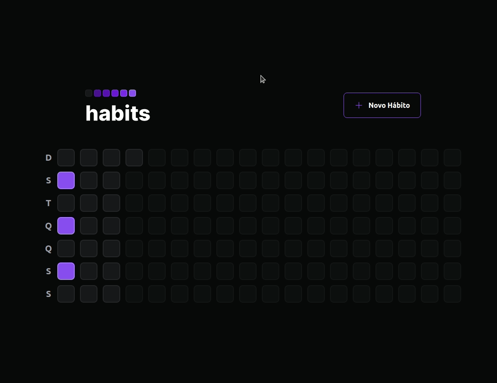
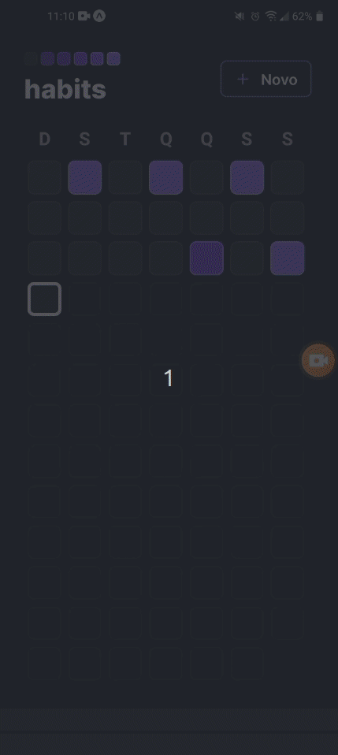

# Habits Tracker

This project was developed during [RocketSeat's](https://www.rocketseat.com.br/) NLW event. A Full-Stack application, containing database, API, web and mobile version.


## Demo Web



## Demo Mobile



## Features

- Creation of a new habit;
- Mark habit as completed;
- Create periodicity for the habits;

## Tech Stack

**Web:** React, TypeScript, CSS3, Tailwindcss, Radix-ui, Axios, clsx;

**Mobile:** React-Native, TypeScript, CSS3, Tailwindcss, Expo, React-Native-Reanimated;

**Server:** Node, Fastify, TypeScript, Prisma ORM;

**DataBase:** SQLite

## Run locally

### Back-End

Clone the repository

```bash
  git clone git@github.com:PhilipLages/habits-tracker.git
```

go to project's directory

```bash
  cd habits-tracker/server
```

Create database

```bash
  npx prisma migrate dev
```

Start server

```bash
  npm run dev
```
### Front-End

go to project's directory

```bash
  cd habits-tracker/web
```

Start server

```bash
  npm run dev
```
Access Vite link
